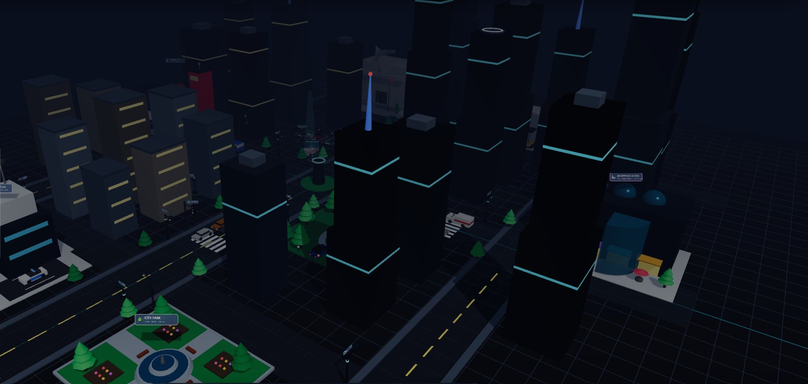
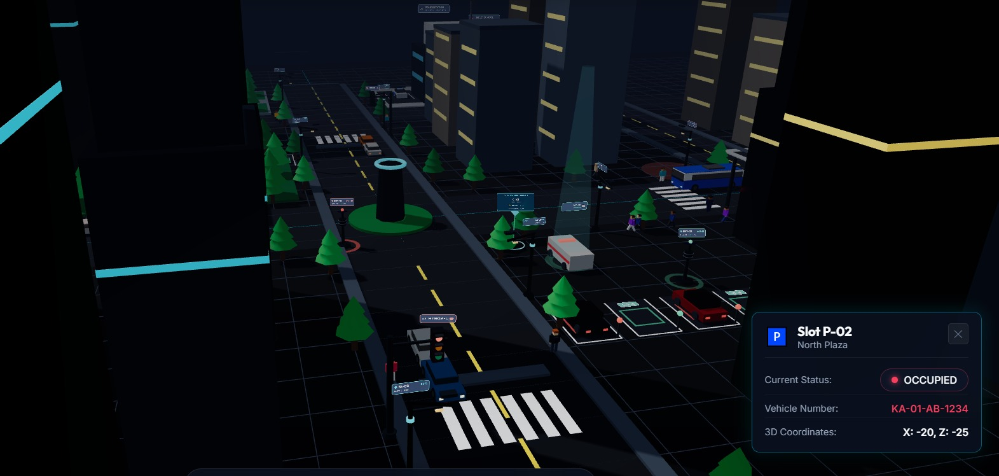
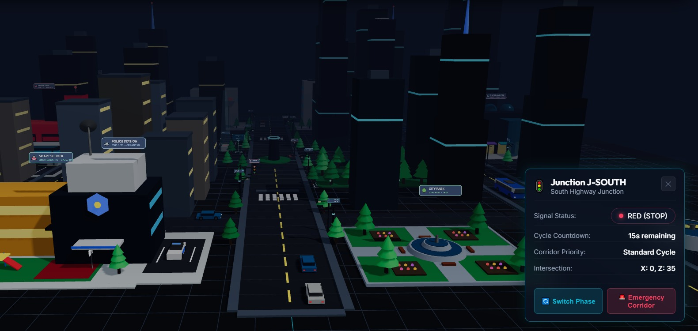
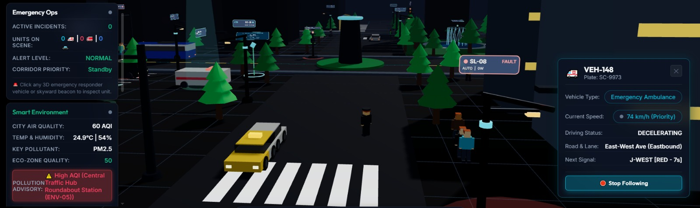
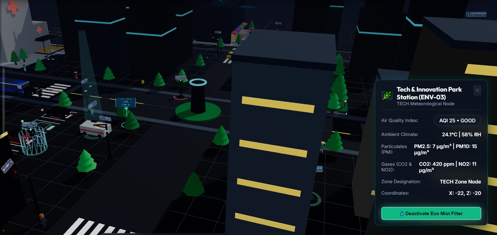
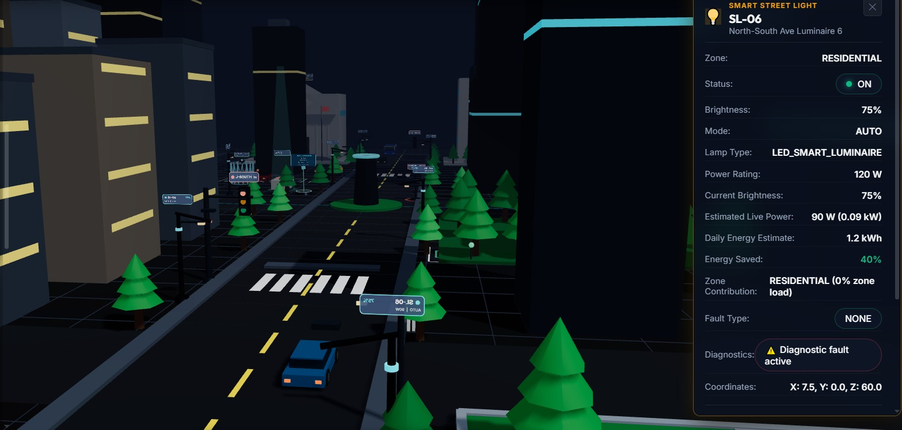

# 🏙️ SmartCity3D-Web

## 3D Smart City Digital Twin & Urban Monitoring Platform

SmartCity3D-Web is a web-based 3D Smart City Digital Twin designed to visualize and monitor modern urban infrastructure in an interactive 3D environment.

The project combines **Three.js, JavaScript, Node.js, Express.js and MongoDB** to simulate smart-city systems such as traffic management, smart parking, emergency response, environmental monitoring, smart street lighting, pedestrians, vehicles and energy analytics.

---

## ✨ Key Features

- 🏙️ Interactive 3D Smart City
- 🚗 Smart Vehicle & Traffic Simulation
- 🚦 Smart Traffic Signal Management
- 🅿️ Smart Parking Monitoring
- 🚑 Emergency Management System
- 🌱 Environmental Monitoring
- 💡 Smart Street Lighting
- 🏢 Smart City Facilities
- 🚶 Pedestrian Simulation
- ⚡ Energy Optimization & Analytics
- 🌙 Day/Night Simulation
- 📊 Real-time City Dashboard
- 🗄️ MongoDB Database Integration
- 🔌 REST API Backend
- 📱 Responsive Web Interface

---

## 🧩 Smart City Systems

### 1. 🚦 Smart Traffic

The traffic system provides:

- 4 smart junctions
- Red, yellow and green signals
- Signal countdown
- Vehicle signal compliance
- Emergency vehicle priority
- Emergency corridor support
- Traffic density simulation

### 2. 🅿️ Smart Parking

The parking system provides:

- 8 parking slots
- Available/occupied status
- Occupancy percentage
- 3D parking visualization
- Parking inspector

### 3. 🚑 Emergency Management

The emergency system provides:

- Emergency incident monitoring
- Ambulance and responder vehicles
- Emergency priority
- Green corridor support
- Incident status management
- 3D emergency markers

### 4. 🌱 Environment Monitoring

The environmental system monitors:

- Air Quality Index (AQI)
- PM2.5
- PM10
- CO₂
- NO₂
- Temperature
- Humidity

It also includes an interactive Eco Mist feature for environmental simulation.

### 5. 💡 Smart Street Lighting

The smart lighting system provides:

- 16 smart street lights
- Automatic brightness control
- Vehicle-aware adaptive lighting
- Eco Radar mode
- Manual mode
- Fault detection
- Fault reset
- Energy monitoring

### 6. 🏢 Smart City Facilities

The 3D city includes:

- City Hospital
- Police Station
- Fire Station
- Smart School
- Bus Station
- City Park
- Government Office
- Shopping Center
- Power Station
- Water Treatment Plant

### 7. 🚶 Pedestrian Simulation

The pedestrian system includes:

- 24 pedestrians
- Multiple pedestrian types
- Sidewalk navigation
- Crosswalk safety
- Vehicle avoidance
- Emergency vehicle yielding
- Day/night behavior

### 8. 🚗 Vehicle Simulation

The vehicle simulation includes:

- Cars
- Buses
- Taxis
- Ambulances
- Traffic signal compliance
- Collision avoidance
- Emergency vehicle priority
- Follow-camera interaction

### 9. ⚡ Energy Analytics

The energy analytics system provides:

- Current power demand
- Daily energy projection
- Monthly energy projection
- Energy cost estimation
- Energy savings
- Zone-wise analytics
- Lighting optimization

---

## 🛠️ Technology Stack

### Frontend

- HTML5
- CSS3
- JavaScript
- Three.js
- WebGL

### Backend

- Node.js
- Express.js
- REST APIs

### Database

- MongoDB Atlas
- MongoDB
- Mongoose

### Development Tools

- Visual Studio Code
- Google Chrome
- Microsoft Edge
- npm

---

## 📁 Project Structure

```text
SmartCity3D-Web/
│
├── public/
│   ├── css/
│   │   └── style.css
│   │
│   ├── js/
│   │   ├── analytics/
│   │   ├── city/
│   │   ├── core/
│   │   ├── interaction/
│   │   └── simulation/
│   │
│   └── index.html
│
├── server/
│   ├── config/
│   ├── controllers/
│   ├── data/
│   ├── middleware/
│   ├── models/
│   └── routes/
│
├── scratch/
│   └── testing and verification scripts
│
├── .env.example
├── .gitignore
├── package.json
├── package-lock.json
├── server.js
└── README.md
---

## 📸 Project Screenshots

### 🏙️ Main 3D Smart City View



### 🅿️ Smart Parking System



### 🚦 Smart Traffic Signal System



### 🚑 Emergency Management System



### 🌿 Smart Environment Monitoring



### 💡 Smart Street Lighting System

